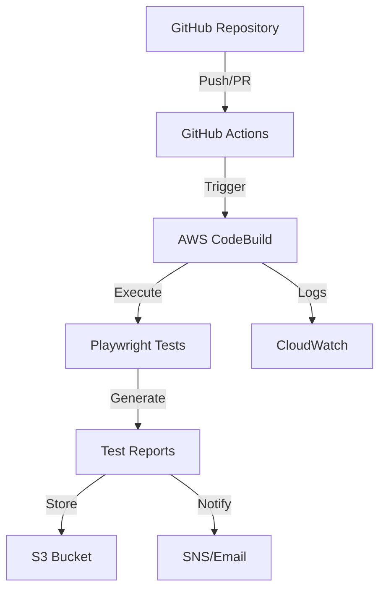

# 🚀 Guía de Integración CI/CD: Playwright + AWS CodeBuild + GitHub Actions

## 📋 Índice

- [Arquitectura de la Solución](#-arquitectura-de-la-solución)
- [Requisitos Previos](#-requisitos-previos)
- [Configuración AWS CodeBuild](#️-configuración-aws-codebuild)
- [Configuración GitHub Actions](#-configuración-github-actions)
- [Optimización del Proyecto](#-optimización-del-proyecto)
- [Gestión de Secretos](#-gestión-de-secretos)
- [Configuración de Reportes](#-configuración-de-reportes)
- [Monitoreo y Notificaciones](#-monitoreo-y-notificaciones)
- [Mejores Prácticas](#-mejores-prácticas)
- [Troubleshooting](#-troubleshooting)

## 🏗️ Arquitectura de la Solución



### Flujo de Trabajo:

1. **Push/PR** → Activa GitHub Actions
2. **GitHub Actions** → Dispara AWS CodeBuild
3. **CodeBuild** → Ejecuta pruebas Playwright
4. **Resultados** → Se almacenan en S3 y se envían notificaciones

## 📋 Requisitos Previos

### AWS Requirements:

- [ ] Cuenta AWS con permisos de administrador
- [ ] AWS CLI instalado y configurado
- [ ] Terraform o CloudFormation (opcional)

### GitHub Requirements:

- [ ] Repository con acceso a GitHub Actions
- [ ] Permisos para crear secrets
- [ ] Branch protection rules configuradas

### Local Requirements:

- [ ] Node.js 18+
- [ ] AWS CLI
- [ ] Git configurado

## ⚙️ Configuración AWS CodeBuild

### 1. Crear el archivo `buildspec.yml`

Crea este archivo en la raíz de tu proyecto:

```yaml
# buildspec.yml
version: 0.2

env:
  variables:
    NODE_VERSION: '18'
    PLAYWRIGHT_VERSION: '1.57.0'
    CI: 'true'

phases:
  install:
    runtime-versions:
      nodejs: $NODE_VERSION
    commands:
      - echo "Installing dependencies..."
      - npm ci
      - echo "Installing Playwright browsers..."
      - npx playwright install chromium
      - npx playwright install-deps chromium

  pre_build:
    commands:
      - echo "Pre-build phase started on `date`"
      - echo "Setting up environment variables"
      - echo "Node version:" $(node --version)
      - echo "NPM version:" $(npm --version)
      - echo "Playwright version:" $(npx playwright --version)

  build:
    commands:
      - echo "Build phase started on `date`"
      - echo "Running Playwright tests..."
      - npm run test

  post_build:
    commands:
      - echo "Post-build phase started on `date`"
      - echo "Tests completed"
      - |
        if [ $CODEBUILD_BUILD_SUCCEEDING -eq 0 ]; then
          echo "Tests failed!"
          exit 1
        else
          echo "Tests passed successfully!"
        fi

artifacts:
  files:
    - test-results/**/*
    - playwright-report/**/*
  name: playwright-test-artifacts-$(date +%Y-%m-%d-%H-%M-%S)

reports:
  playwright-tests:
    files:
      - test-results/junit.xml
    file-format: JUNITXML
  playwright-coverage:
    files:
      - test-results/results.json
    file-format: JSONFMT

cache:
  paths:
    - node_modules/**/*
    - /root/.cache/ms-playwright/**/*
```

### 2. Crear IAM Role para CodeBuild

```bash
# Crear role de IAM
aws iam create-role \
    --role-name playwright-codebuild-role \
    --assume-role-policy-document '{
        "Version": "2012-10-17",
        "Statement": [
            {
                "Effect": "Allow",
                "Principal": {
                    "Service": "codebuild.amazonaws.com"
                },
                "Action": "sts:AssumeRole"
            }
        ]
    }'

# Adjuntar política básica
aws iam attach-role-policy \
    --role-name playwright-codebuild-role \
    --policy-arn arn:aws:iam::aws:policy/CloudWatchLogsFullAccess

# Crear política customizada para S3 y Parameter Store
aws iam put-role-policy \
    --role-name playwright-codebuild-role \
    --policy-name PlaywrightCodeBuildPolicy \
    --policy-document '{
        "Version": "2012-10-17",
        "Statement": [
            {
                "Effect": "Allow",
                "Action": [
                    "s3:GetObject",
                    "s3:PutObject",
                    "s3:DeleteObject"
                ],
                "Resource": "arn:aws:s3:::playwright-test-artifacts/*"
            }
        ]
    }'
```

### 3. Crear proyecto CodeBuild

```bash
# Crear proyecto CodeBuild
aws codebuild create-project \
    --name "playwright-tests-project" \
    --description "Automatización de pruebas Playwright" \
    --service-role "arn:aws:iam::169424236477:role/playwright-codebuild-role" \
    --artifacts '{
        "type": "S3",
        "location": "playwright-test-artifacts"
    }' \
    --environment '{
        "type": "LINUX_CONTAINER",
        "image": "aws/codebuild/amazonlinux2-x86_64-standard:4.0",
        "computeType": "BUILD_GENERAL1_MEDIUM",
        "environmentVariables": [
            {
                "name": "CI",
                "value": "true"
            }
        ]
    }' \
    --source '{
        "type": "GITHUB",
        "location": "https://github.com/jdjulius/test-playwright-tests-ai.git"
    }'
```

## 🔧 Configuración GitHub Actions

### 1. Crear workflow de GitHub Actions

Crea `.github/workflows/playwright-tests.yml`:

```yaml
# .github/workflows/playwright-tests.yml
name: Playwright Tests CI/CD

on:
  push:
    branches: [main, develop]
  pull_request:
    branches: [main]

env:
  AWS_REGION: us-east-1
  CODEBUILD_PROJECT_NAME: playwright-tests-project

jobs:
  trigger-codebuild:
    runs-on: ubuntu-latest

    steps:
      - name: Checkout code
        uses: actions/checkout@v4

      - name: Configure AWS credentials
        uses: aws-actions/configure-aws-credentials@v4
        with:
          aws-access-key-id: ${{ secrets.AWS_ACCESS_KEY_ID }}
          aws-secret-access-key: ${{ secrets.AWS_SECRET_ACCESS_KEY }}
          aws-region: ${{ env.AWS_REGION }}

      - name: Start CodeBuild
        id: codebuild
        run: |
          BUILD_ID=$(aws codebuild start-build \
            --project-name ${{ env.CODEBUILD_PROJECT_NAME }} \
            --source-version ${{ github.sha }} \
            --query 'build.id' \
            --output text)
          echo "build-id=$BUILD_ID" >> $GITHUB_OUTPUT
          echo "Started CodeBuild: $BUILD_ID"

      - name: Wait for CodeBuild completion
        run: |
          BUILD_ID="${{ steps.codebuild.outputs.build-id }}"
          echo "Waiting for build $BUILD_ID to complete..."

          while true; do
            BUILD_STATUS=$(aws codebuild batch-get-builds \
              --ids $BUILD_ID \
              --query 'builds[0].buildStatus' \
              --output text)
            
            echo "Current status: $BUILD_STATUS"
            
            if [ "$BUILD_STATUS" = "SUCCEEDED" ]; then
              echo "Build completed successfully!"
              break
            elif [ "$BUILD_STATUS" = "FAILED" ] || [ "$BUILD_STATUS" = "FAULT" ] || [ "$BUILD_STATUS" = "STOPPED" ] || [ "$BUILD_STATUS" = "TIMED_OUT" ]; then
              echo "Build failed with status: $BUILD_STATUS"
              exit 1
            fi
            
            sleep 30
          done

      - name: Download test artifacts
        run: |
          BUILD_ID="${{ steps.codebuild.outputs.build-id }}"
          ARTIFACT_LOCATION=$(aws codebuild batch-get-builds \
            --ids $BUILD_ID \
            --query 'builds[0].artifacts.location' \
            --output text)

          if [ "$ARTIFACT_LOCATION" != "None" ]; then
            echo "Downloading artifacts from: $ARTIFACT_LOCATION"
            aws s3 cp $ARTIFACT_LOCATION ./artifacts/ --recursive
          fi

      - name: Upload test results
        uses: actions/upload-artifact@v4
        if: always()
        with:
          name: playwright-report
          path: |
            artifacts/

      - name: Comment PR with results
        if: github.event_name == 'pull_request'
        uses: actions/github-script@v7
        with:
          script: |
            const fs = require('fs');
            const path = './artifacts/test-results/results.json';

            if (fs.existsSync(path)) {
              const results = JSON.parse(fs.readFileSync(path, 'utf8'));
              const { stats } = results;
              
              const body = `## 🎭 Playwright Test Results
              
              | Metric | Value |
              |--------|-------|
              | ✅ Passed | ${stats.passed} |
              | ❌ Failed | ${stats.failed} |
              | ⏭️ Skipped | ${stats.skipped} |
              | ⏱️ Duration | ${Math.round(stats.duration / 1000)}s |
              
              [View detailed report](https://github.com/${{ github.repository }}/actions/runs/${{ github.run_id }})
              `;
              
              github.rest.issues.createComment({
                issue_number: context.issue.number,
                owner: context.repo.owner,
                repo: context.repo.repo,
                body: body
              });
            }
```

## 🔧 Optimización del Proyecto

### 1. Optimizar `playwright.config.js` para CI

```javascript
// playwright.config.js
import { defineConfig, devices } from '@playwright/test';
import dotenv from 'dotenv';

// Load environment variables
dotenv.config();

const isCI = !!process.env.CI;

export default defineConfig({
  testDir: './test',

  // Timeouts optimizados para CI
  timeout: isCI ? 45000 : 60000,
  expect: { timeout: isCI ? 10000 : 30000 },

  // Configuración de workers optimizada
  workers: isCI ? 2 : undefined,

  // Reintentos optimizados
  retries: isCI ? 2 : 0,

  // Solo reportes necesarios en CI
  reporter: isCI
    ? [
        ['html', { outputFolder: 'playwright-report' }],
        ['json', { outputFile: 'test-results/results.json' }],
        ['junit', { outputFile: 'test-results/junit.xml' }],
      ]
    : [['html']],

  use: {
    baseURL: process.env.BASE_URL || 'https://dev.paisabombas.app/',

    // Configuración optimizada para CI
    headless: isCI,
    slowMo: isCI ? 0 : 500,

    // Artifacts optimizados para CI
    screenshot: isCI ? 'only-on-failure' : 'on',
    video: isCI ? 'retain-on-failure' : 'on',
    trace: isCI ? 'on-first-retry' : 'on',

    // Configuraciones adicionales para estabilidad
    actionTimeout: 30000,
    navigationTimeout: 30000,
  },

  projects: [
    {
      name: 'chromium',
      use: { ...devices['Desktop Chrome'] },
    },
    // Agregar más navegadores si es necesario
    ...(isCI
      ? []
      : [
          {
            name: 'firefox',
            use: { ...devices['Desktop Firefox'] },
          },
        ]),
  ],
});
```

### 2. Optimizar scripts en `package.json`

```json
{
  "scripts": {
    "test": "playwright test",
    "test:ci": "CI=true playwright test",
    "test:headed": "HEADLESS=false playwright test",
    "test:loginTest": "playwright test test/loginTest/loginTest.spec.js",
    "test:compras": "playwright test test/comprasTest/",
    "test:parallel": "playwright test --workers=4",
    "report": "playwright show-report",
    "report:open": "npx playwright show-report",
    "install:browsers": "npx playwright install",
    "install:deps": "npx playwright install-deps"
  }
}
```

## 🔒 Gestión de Secretos

### 1. Configurar GitHub Secrets

En tu repositorio de GitHub, ve a **Settings > Secrets and Variables > Actions** y agrega:

```
AWS_ACCESS_KEY_ID=AKIA...
AWS_SECRET_ACCESS_KEY=xxx...
AWS_REGION=us-east-1
CODEBUILD_PROJECT_NAME=playwright-tests-project
```

## 📊 Configuración de Reportes

### 1. Configurar S3 para almacenar reportes

```bash
# Crear bucket para artifacts
aws s3 mb s3://playwright-test-artifacts

# Configurar lifecycle policy
aws s3api put-bucket-lifecycle-configuration \
    --bucket playwright-test-artifacts \
    --lifecycle-configuration '{
        "Rules": [
            {
                "ID": "DeleteOldReports",
                "Status": "Enabled",
                "Expiration": {
                    "Days": 30
                }
            }
        ]
    }'
```

## 🎯 Mejores Prácticas

### 1. **Organización de Tests**

- Separar tests por funcionalidad
- Usar tags para categorizar tests
- Implementar tests de smoke para CI/CD

### 2. **Performance**

- Usar workers paralelos en CI
- Implementar test sharding para suites grandes
- Optimizar timeouts para CI

### 3. **Estabilidad**

- Implementar esperas inteligentes
- Usar retry strategies
- Configurar health checks

### 4. **Seguridad**

- Rotar credenciales regularmente
- Usar roles IAM mínimos
- Encriptar datos sensibles

### 5. **Mantenimiento**

- Limpiar artifacts antiguos
- Actualizar dependencias regularmente

## 🔧 Troubleshooting

### Problemas Comunes

1. **Browsers no se instalan en CodeBuild**

   ```bash
   # Solución: Agregar install-deps
   npx playwright install-deps chromium
   ```

2. **Tests fallan por timeouts**

   ```javascript
   // Aumentar timeouts en CI
   timeout: process.env.CI ? 60000 : 30000;
   ```

3. **Artifacts no se suben**
   ```bash
   # Verificar permisos S3
   aws s3 ls s3://playwright-test-artifacts --recursive
   ```

### Logs útiles

```bash
# Ver builds recientes
aws codebuild list-builds --sort-order DESCENDING --max-items 10

# Ver logs específicos de un build
aws codebuild batch-get-builds --ids BUILD_ID
```

---

## 🚀 Pasos de Implementación

1. **Crear buildspec.yml** en tu repositorio
2. **Configurar AWS CodeBuild** project
3. **Agregar GitHub Actions** workflows
4. **Configurar secretos** de GitHub
5. **Optimizar configuración** de Playwright
6. **Configurar reportes** en S3
7. **Probar el pipeline** completo

¡Con esta configuración tendrás un pipeline robusto para ejecutar tus pruebas Playwright en AWS CodeBuild integrado con GitHub Actions! 🎉
